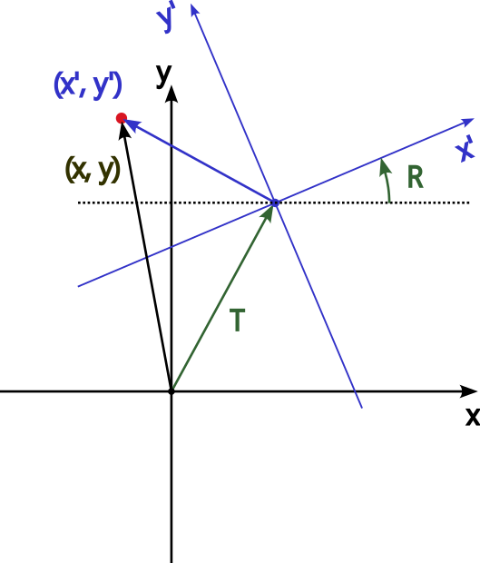

# 並進・回転による座標系の変換

空間内のある点Pを、あるデカルト座標系Sで測った座標を$\vec{x}$とする。もう一つのデカルト座標系S'があり、座標系S'は

* 座標系Sに対して、原点が$\vec{T}$だけシフトした位置にあり、
* さらにシフトした原点の周りでS’の軸がSの軸に対して回転行列$R$で回転している。

この状況を示したのが隣の図である。
{width="300px" align=left}

座標系S'で同じ点Pを測ったときの座標を$\vec{x}'$とすると、$\vec{x}$と$\vec{x}'$の間には次の関係が成り立つ。

$$
\begin{eqnarray}
  \vec{x}' &=& R^{-1}(\vec{x} - \vec{T}) \\
  \vec{x} &=& R\vec{x'} + \vec{T}
\end{eqnarray}
$$
